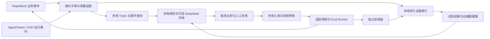

# RepoMesh 观测与评估 Spec（默认本地，AgentLoop 可选）

v0.3 部署变更：按用户“全本地”要求及 [ADR 0024](../adr/0024-local-observation-workbench.md)，默认由本地工作台承担查询、证据数据集和评测展示；模型评审允许 DeepSeek API。AgentLoop 的字段映射、云接入流程与对应验收保留为可选适配，不再是本地使用的前置条件。当前能力见[本地工作台说明](local-observation-workbench.md)，其余未实现字段与 DSH 验收仍按各项范围判断。

本文规定应采集什么、如何关联 Trace、如何评估交付效果及如何验收接入。以评委提出的五类交付问题为主线，以用户明确的「后续取消 CLI coding agent，使用 AgentTeams 原生 DeepSeekHarness」为目标执行方向。用户提供的《AgentTeams 评测方法论与实施规范 AgentLoop》v1.0 仅作参考，其 Python Runner、实施指令、样本规模和阈值不自动成为本项目要求。

本文是待实施设计。字段与事件名是 RepoMesh 的观测契约提案，不是既有数据库／HTTP／MCP Schema，也不是 AgentLoop SDK。本文不宣称已建立云空间、接通 DSH、跑过评估或改善了成功率；不恢复旧实验或更改既有执行权限。

2026-09-19 实施补充：用户随后授权本地搭建，已开始交付发现历史、本地证据与 OTLP 导出、独立折扣验收、CSV／评分回读以及官方本地 Launcher／Collector。实际完成和限制以[实施记录](../development/2026-09-19-agentloop-observability-01/README.md)、[开发说明](agentloop-observation-development.md)为准；下文完整字段、DSH 与云端能力仍按各项验收，不因局部实现一并标为通过。

v0.2 补充最小改动接入、外部适配与长期兼容规则（第 2.3—2.6 节），并增加升级验收。此次为设计约束补充，示例事件格式仍为 `repomesh-observe/0.1`，未变更已实现协议。

## 1. 目标与成功标准

核心目标：每个交付问题都能追到当时的工作依据、真实执行对象和结果，并通过固定条件的实验验证改进。首个完整闭环选择「折扣语义变化，本仓测试通过，跨仓金额不一致」。

| 编号 | 要改善的交付问题 | Trace 必须能回答 | 改善成立的条件 |
| --- | --- | --- | --- |
| O1 | 漏掉关联仓库 | 初始可选范围是什么；为什么选中／排除；扫描对应哪次提交；何时发现遗漏？ | 必要仓库遗漏下降，无关仓库参与及无必要修改没有增加。 |
| O2 | 本仓通过、联调失败 | 本仓测试用了什么替身；两端收到哪版契约；真正跑的是哪组提交；依赖是否满足？ | 固定版本组合通过独立验收，首次联调通过情况改善。 |
| O3 | 反复返工 | 首次失败是什么；重试前输入／代码／契约是否变化；新增了什么证据？ | 无进展重复减少，固定预算内最终质量保持。 |
| O4 | 执行很慢 | 时间花在依赖等待、资源排队、Worker 启动、模型、工具还是验证？ | 已定位的关键路径缩短，同时质量与超时情况不恶化。 |
| O5 | 人迟迟无法批准 | 人看到哪版证据；缺什么；反复追问什么；是未开始审查还是实际审查很久？ | 审查用时及补证轮数下降，错误批准没有增加。 |

一次完整演示必须串起：失败证据 → 有依据的根因判断 → 有版本的机制修改 → 同起点复验 → 未参与调优的相似任务验证。模型回复、工具退出、任务终态、验收通过和人工合并分别记录。

## 2. 当前基线与系统职责

### 2.1 已核对的源码与限制

本次 RepoMesh 阅读基线为 `28c31677e349cd89c5abff3c7cf26e8b960d526a` 加既有工作区修改；独立 AgentTeams checkout 为 `517caff9280242a00a4d4c06365352b9e41659c6`。这是源码检查，不是当前部署核查，也不代表未来采用的上游版本。

| 已有入口 | 可以复用 | 本 Spec 要补齐的部分 |
| --- | --- | --- |
| [扫描类型](../../internal/scan/types.go)、[候选发现](../../internal/discovery/steps.go) | 扫描画像、依赖证据和 Issue 范围约束 | 冻结实际使用的画像、扫描提交、选中与排除理由，区分范围不足与范围内漏选。 |
| [计划修订](../../internal/tasks/revision.go)、[执行记录](../../internal/execution/agent_run.go) | 修订原因、任务快照和执行事件 | 连接实际生效修订、外部运行身份及候选产物，不复制一套任务引擎。 |
| [当前 Trace 查询](../../internal/observability/trace_v1.go) | 会话与事件读取界面 | 当前 Issue 归属用调用时间前后 15 分钟近似匹配；正式评测改用明确绑定。 |
| [联调比较](../../internal/jointvalidation/service.go) | 检查入口 | 当前摘要字符串包含检查不构成业务验收；增加固定组合的实际行为检查。 |
| [Skill 内容入口](../../internal/skills/seeddoc.go)、[规划派发](../../cmd/repomesh-coordinator/planning.go) | 已有内容与执行入口 | 记录真正注入的内容摘要；技能库更新不能直接当作运行版本已改变。 |
| [人工决定](../../internal/humancontrol/service.go) | 带证据版本的审查与决定 | 连接组合、补证和审查时间，保留原决定及后续更正。 |

### 2.2 职责分配

| 组件 | 责任 |
| --- | --- |
| RepoMesh | 保存正式业务身份、范围、修订、候选组合、判定和人工决定；输出有来源的业务事件。 |
| AgentTeams／DeepSeekHarness | 执行团队工作；提供可验证的上游任务、消息、session、turn、工具及模型调用观察。运行生命周期仍遵守既有管理归属。 |
| 采集与导出适配 | 关联身份、脱敏、去重、保存原始引用，将业务和运行事件转换为 Trace／日志；记录缺失与导出失败。 |
| 本地工作台／可选 AgentLoop | 默认本地保存、查询、数据集与结果展示，按需调用 DeepSeek 评审；AgentLoop 为可选外部适配。人工标注等未实现能力单独验收。 |
| Eval Runner／独立验收器 | 固定实验条件、隔离试验、调用现有产品流程、冻结产物、运行正式检查、保存结果及比较。它不替代产品调度器。 |

AgentLoop 的观测、数据集和自定义评估能力有[官方产品说明](https://help.aliyun.com/zh/agentloop/product-overview/what-is-agentloop)；具体账号、部署版本和 DSH 链路是否接通，按第 8 节实测。正式状态以 RepoMesh 及独立验收事实为依据，不由云端一条分数反向覆盖。



### 2.3 最小改动原则与接入层次

第 4 节列出的是需要取得的事实，不是要求对每个名称新增一处业务埋点。先检查既有持久记录和原生运行事件，缺什么再补什么。实施不得将 AgentLoop SDK、云端身份、评估器逻辑或平台字段映射散布到业务包。

| 层次 | 接入方式及本体改动 | 可以做到 | 明确限制 |
| --- | --- | --- | --- |
| L0：外部读取与产物评估 | 独立运行器／采集器读取授权的既有接口、持久记录、原生事件及 Git／测试产物；不修改业务逻辑 | 固定组合验收、已有阶段状态与历史查询、已有原生事件的诊断 | 没有保存的理由、瞬时变化、精确消费身份不能靠事后采集恢复；不能据此宣称完整 Trace。 |
| L1：最小业务补充 | 只在现有持久化与派发边界补齐缺失版本、因果、运行身份和证据引用；必要时提供窄的版本化读取／导出面 | 满足评委所需的准确版本关联、决策依据和交付证据 | 需要维护一个小范围的业务观测契约，不能承诺零本体改动。 |
| L2：运行时细节 | 在 AgentTeams／DSH 适配或已有模型／工具采集层增加运行事件，外部归一化 | 模型／工具用量、turn、交接、重试及细粒度性能 | 随选定上游版本校验，不提前改造将被替换的 CLI 路径。 |

首期采用 L0 起步、L1 补关键缺口、DSH 接通后逐项增加 L2 的顺序。L0 可以完成独立验收工具的建设，但完整业务归因的验收仍要求 L1 所需事实存在。各层采集范围写入能力清单，未采集的阶段保持 unknown。

### 2.4 本体只保留三类必要能力

下表是三类边界能力，不是承诺只修改三行或三个文件。实施前应列出「事实 → 现有来源 → 缺口 → 必要调用点」，按缺口确定最小补丁。

| 能力 | 本体负责的最少内容 | 应复用与避免 |
| --- | --- | --- |
| 保存业务事实与修订引用 | 决策时的输入快照／引用、结果、理由来源、对象版本和因果身份 | 复用计划修订、决策链、Attempt 历史、人工决定；不新建第二套状态机，不把当前行反复采样冒充完整历史。 |
| 绑定真实执行上下文 | 派发身份与实际消息／turn 的对应；实际使用的 Spec、DAG、Prompt／Skill 内容版本 | 在派发／消费适配边界完成；业务包不需要了解 DSH JSONL 格式或 AgentLoop 的字段名。 |
| 登记产物和证据 | 候选提交、固定组合、验证结果与正文引用 | 正式结果沿原用例写入；测试执行、统计、Judge 和报告尽量在独立评测侧完成。 |

已有 [PlanRevisedEvent](../../internal/tasks/revision.go) 和 [Attempt 事件](../../internal/execution/service.go)可作为来源或接入位置，但目前尚无覆盖全部业务的稳定观测出口。`public.events` 有表结构不等于全部生产者已写入，更不代表其字段能不经核对直接承载现有各种 ID。

例如[候选发现保存逻辑](../../internal/discovery/service.go)会更新当前候选与分类；仅轮询这行可能错过中间变化。若旧决定、排除理由或使用的画像未持久保留，应在实际决定的保存边界记录快照。不能把提高轮询频率当作准确历史的保证。

新增的观测桥接集中在现有边界模块／组装层，业务侧只依赖项目自己的窄契约。物理存储优先复用已满足语义的记录；确有不可恢复缺口才增加必要的持久字段或历史记录，不要求先迁移全部业务表。

### 2.5 外部适配与故障隔离

```text
RepoMesh 已提交事实 ── RepoMesh 来源适配 ──┐
AgentTeams / DSH ───── 运行时来源适配 ─────┼─ 统一事件与证据索引
Git / 正式验收产物 ─── 产物来源适配 ───────┘          │
                                         ┌────────┴─────────┐
                                         ▼                  ▼
                                  AgentLoop 导出适配   Eval Runner / Verifier
```

这些是逻辑模块，可按部署需要放入一个旁路进程或独立工具，不要求为每个适配器建立一个服务。导出器拥有云端连接，评测侧拥有数据集与 rubric；正常业务不等待 AgentLoop 的网络响应。

来源访问按以下优先级选择：

1. 已有且语义稳定的授权查询／事件出口；必要时增加一个窄的版本化导出面，而不是给所有业务资源重做 API。
2. 已提交的追加历史／证据文件；只读访问必须限定对象和字段，读取游标需能正确处理事务提交顺序及重复扫描，不能假设自增 ID 顺序就是提交顺序。
3. 在尚无稳定出口时，可使用明确标注为临时的只读数据库适配。SQL、迁移版本匹配及多表一致性读取集中在这一个适配器，业务字段变化不扩散到所有指标和评估器。
4. 自由文本日志、UI 抓取及当前状态轮询只作诊断补充，不能作为长期正式证据的唯一来源。发生时间不明时记录观察时间，不倒推精确转移时点。

可靠关键历史与云端遥测分开：原业务所需的身份、版本、结果按本地一致性规则保存；必要事件引用可复用事务内历史／outbox。云端上报在提交后异步执行，回滚事务不得导出为已生效业务事实。单纯在提交后打印一次日志，仍存在进程崩溃导致证据丢失的窗口，不能替代必要持久记录。

AgentLoop 不可用或旁路采集器停止时，产品原有调度与执行语义不因云端故障改变。缓存、积压和重试有界，部署前明确存储容量、保留与丢弃策略；丢失诊断事件须上报缺口，关键证据缺失时不能给出完整评测结论。外部遥测失败可降级，不等于本地必要业务记录写入失败也可以忽略；不承诺存储耗尽时同时满足业务永不阻塞与证据零丢失。

### 2.6 长期兼容与升级规则

持久性来自稳定业务语义和可替换适配，不来自承诺所有底层格式永远不变。判断每次修改影响如下：

| 后续变化 | 预期修改位置 | 应保留的资产 |
| --- | --- | --- |
| RepoMesh 函数、包、目录重构 | 业务观测出口内部映射；缺口挂点随所属用例调整 | 规范化事件、用例、验收器和指标定义。 |
| 数据库表或字段调整 | RepoMesh 来源适配或稳定导出面的内部实现 | 上层 Trace、结果比较和历史证据，不把所有评估器绑定到物理表。 |
| CLI 更换为 DSH、DSH 升级 | 运行时来源适配、身份映射及能力清单 | Case、固定组合验收、业务事件与历史 Trial。 |
| AgentLoop 字段、SDK 或传输变化 | AgentLoop 导出／结果回读适配 | 本地规范化记录、证据及评估规则。 |
| 折扣规则或产品验收语义变化 | Case／契约／grader 新版本，必要时业务事件 major 升级 | 原要求和原评分，不把不同业务目标直接混合比较。 |

具体兼容要求：

- 事件格式、来源适配器、上游格式、AgentLoop 映射、grader 分别版本化。新增可选字段向后兼容；删除字段、改变单位／含义／身份作用域须升级 major 或显式转换，不能原名换含义。
- 保留可核对的原始来源或受控脱敏原始记录及其格式版本；规范化投影携带转换器版本。重解析生成新投影，不改写旧事件或旧报告；未知来源版本隔离保存并报告能力缺失，不猜字段后继续判分。
- 每个支持的来源版本保留脱敏输入夹具和预期规范化输出。夹具至少覆盖正常、失败、重试、乱序、多 Issue 共 session、缺字段和新枚举；这些是适配器契约测试，不是被测 Agent 能力成绩。
- 每次升级先验证「旧记录仍可读、新记录不串项、去重不变、证据可取、评分可重算」。正式宣称新版本兼容前，再跑一个真实 DSH turn 与一个正／反例组合验收；不能只靠解析夹具通过。
- 分开报告业务能力变化与采集覆盖变化。升级后 Token 缺失、某阶段不再采集或判定规则改变时，先报告不可比，不能显示为成本下降或质量上升。
- 本体接入评审列出所有产品文件改动及必要理由，验证业务包不依赖 AgentLoop SDK、评估逻辑不进入调度、来源字段不散落在多个消费者中；用接入前后测试与实测开销确认没有改变业务语义。尚未实施前不估算改动百分比或承诺零性能开销。

## 3. 观测单位与身份关联

### 3.1 五种身份分别表达

| 身份 | 含义与规则 |
| --- | --- |
| `case_id + case_version` | 一道固定任务及验收要求；只在离线评测中必需。 |
| `trial_id` | 同题、同变体的一次独立试验；内部返工与工具重试不生成新 Trial。 |
| `work_id` | 观测侧稳定工作关联，服务于跨 Trace 查询，不引入新的产品执行状态机。建项前可关联分析作业，建项后追加 Issue 绑定。 |
| `task_id / attempt_id` | 复用 RepoMesh 工作任务与 Worker 执行尝试；基础设施重试另外记 `infra_attempt_id`，评分重跑记 `grading_attempt_id`。 |
| `trace_id / span_id` | 追踪 SDK 生成的有效技术身份；不得直接拿 Issue ID、房间名或自造短字符串冒充。 |

AgentLoop 平台的评估 Task／Run 另存为 `platform_task_id / platform_run_id`，不与 RepoMesh Task 或 Trial 混用。

### 3.2 Trace 划分

一次 Issue 可以持续多天；一个 Trial 可以包含多个 Trace。首期按实际连续操作生成 Trace：需求与规划、一次执行 Attempt、一次组合验证、一次人工交互。统一用 `work_id` 和适用的 `trial_id` 查询，保存全部 Trace 引用及因果边。

不维护跨人工等待数天的内存根 Span，不伪造跨进程持续存活的父 Span。同步调用传递追踪上下文；异步派发持久保存来源上下文，接收方建立消费 Span；多输入汇合关联所有前驱。采用[上下文传播](https://opentelemetry.io/docs/concepts/context-propagation/)和 [Span Links](https://opentelemetry.io/docs/concepts/signals/traces/)表达这些关系。

业务事件仍是顺序、因果和恢复的持久依据。平台若暂不能显示 Link，则通过事件中的 `caused_by_event_ids` 和产物引用查询，不虚构串行父子关系。

### 3.3 DSH 关联链

```text
Project / Issue / Task / Attempt
    ↔ upstream_instance_id / upstream_team_id / upstream_project_id / upstream_task_id
    ↔ Matrix room_id / event_id / sender_id / recipient_id
    ↔ DSH session_id / message_id / execution_attempt / turn 起止序号
    ↔ Trace / Span / 输入版本 / 输出产物
```

不是每种事件都有整条链；存在时记录，不存在时给出原因。普通讨论不能凭房间或发生时间自动绑定 Issue。一个房间对应的长期 DSH session 可承载多条消息，不能把 session 全部事件归给其中一个 Issue。共享模型请求若不能可靠分摊到单项，保留多项关联及未分摊用量，不复制计费。

绑定由可信派发／接收适配生成，并验证项目、仓库和 Attempt 归属；Agent 在文字里写出的 ID 只作陈述。迟到事件追加在原 Attempt，下游是否采纳由业务规则判断。

## 4. Trace 里必须包含什么

### 4.1 记录形态与必填等级

一个可评估的 Trace 包含：技术 Span、业务关联、执行上下文清单引用、输入输出证据、结果与完整性。大正文保存在受控证据存储，Trace 携带引用和摘要；仅有 hash 而无法取得内容不能称为可复核证据。

下面 `M` 为所有规范化事件必需，`C` 为进入相关阶段后必需，`O` 为可选诊断。规范化记录保存在本地账本；适合检索的字段投影为 `repomesh.*`／`eval.*` Span Attributes，其余通过清单查询。字段不是全部塞进每条模型调用，也不要求本体直接生成完整规范化对象：来源适配器可以从既有事实构造，不能推测缺失事实。L0 尚未覆盖的字段按缺失规则表达，其对应的完整验收暂不满足。

### 4.2 公共字段

| 字段组 | 等级 | 内容与用途 |
| --- | --- | --- |
| 记录身份 | M | `schema_version`、`event_id`、`event_name`、`work_id`；标识格式版本和同一事实。 |
| 来源 | M | `producer`、`producer_version`、`source_event_key`、`actor_type`、`actor_id`、`evidence_level`。级别为 `observed / reported / inferred`；Agent 自报与外部核验分开。 |
| 时间 | M | `occurred_at`、`recorded_at`；UTC RFC3339 时间。来源无可靠时间时前者为 null，并记原因。 |
| 技术追踪 | C | `trace_id`、`span_id`、`parent_span_id`、Links。未接入 SDK 的本地事件保留 null 和缺失原因，不伪造 Trace。 |
| 业务归属 | C | `organization_id`、`project_id`、`issue_id`、`change_set_id`、`repository_id`、`task_id`、`attempt_id`；按对象已建立的阶段绑定。 |
| 评测归属 | C | `experiment_id`、`suite_version`、`case_id`、`case_version`、`variant_id`、`trial_id`、`trial_index`；线上普通运行不伪造这些字段。 |
| 因果与恢复 | M | `caused_by_event_ids`、`input_artifact_refs`；独立事件可为空。重试另记 `logical_operation_id`、`retry_of_event_id`、`retry_kind`、`retry_index`。 |
| 上下文与证据 | M | `context_manifest_ref`、`evidence_refs`；尚无产物时证据列表可为空，不能把空列表解释为验证通过。 |
| 结果 | M | `execution_status`、`outcome_verdict`、`error_class`、`reason_code`。尚未判定用 `not_evaluated`，不套用业务成功。 |
| 数据完整性 | M | `collection_status=complete/partial/unknown`、`missing_fields`、`missing_reason`；缺值保留 null，不补零或空字符串。 |

实现可从所属上下文继承上述值，但导出和查询必须能解析到固定版本。至少在每个阶段根 Span 直接提供工作／试验／Issue／Attempt 身份；子 Span 查询需要的过滤键由适配器补齐，不能假设平台自动继承父属性。

规范化事件中的 `execution_status` 采用 `pending / running / completed / failed / timed_out / budget_exceeded / cancelled / unknown`；`outcome_verdict` 采用 `not_evaluated / pass / fail / unknown / not_applicable`。一次选择或版本登记完成可以是 `completed + not_evaluated`，不强制给过程事件打通过分。`error_class`、`reason_code` 无适用值时为 null；这些枚举仅用于观测归一化，不改写来源系统的原始状态。

### 4.3 不可变上下文清单

在决定或执行开始时保存当时快照；后续变化生成新清单并关联旧版，不能在查询时读「当前最新版」替代历史。

| 清单内容 | 何时必须具备 | 明确区分 |
| --- | --- | --- |
| 产品构建、工作区补丁摘要、部署标识、数据库迁移版本 | 每次实验、每个运行生产者 | 源码 HEAD 与真正运行的二进制。 |
| AgentTeams commit、Worker 镜像 digest、DSH 包及适配器版本 | 上游执行前 | runtime 名称与实际版本；Harness 版本与模型版本。 |
| 需求／Spec、接口契约、验收条件的 ID、修订及内容摘要 | 选仓、规划、执行和验证 | 用户原要求、后续解释、正式采用版本和各 Agent 实际收到的版本。 |
| Plan／DAG 修订及内容摘要 | 派工与结果采纳 | 提议、获准、应用请求、读回确认、生效是不同事实；运行时图与业务计划可有独立修订。 |
| 项目范围、Issue 范围、有效可选集合 | 选仓和派工 | 没有访问权／未获准、扫描失败、被判无关是不同原因。 |
| 扫描结果及扫描提交、画像摘要、规则版本 | 选仓决定 | 扫描生成时间与依据新鲜度；不能只以年龄判断过期，须比较相关提交及覆盖。 |
| 每仓起始 SHA、候选 SHA、组合成员 | 候选、验证与交付 | 预期装配版本与实际运行版本；未修改但参与验证的仓库也固定 SHA。 |
| Skill、Prompt、脚本内容及摘要 | 实际使用前 | 配置期望、实际装载、注入输入、工具读取分别记录；注入不等于模型正确遵循。 |
| 模型供应商、请求／响应模型标识、参数、工具集合、配置修订、预算 | Agent／模型调用 | 配置值与实际值；无实际观察时标明未知。不得存储秘密值。 |
| 环境、构建产物、依赖锁、数据库初态、测试数据、Verifier 与规则版本 | 正式验证前 | 外部依赖 mock 与被测真实链路，产品验收与评测器运行。 |

Skill 未使用时记录 `skill_state=not_used` 和实际工作说明；声明使用但拿不到内容时记 `unverified`。重放执行前提需要可取回的内容，不能只有名称或 `latest`。

### 4.4 Span 与事件目录：观测什么

表中的名称是项目约定。`*.started / *.finished / *.failed` 表示对应操作事件；修订、选择、人工决定为发生时刻的事件。持续等待按进入／离开事件计算，必要时投影为区间。

| 阶段／建议名称 | 除公共字段外必须记录 | 用它回答的问题 |
| --- | --- | --- |
| `requirement.captured` | 原始需求引用、范围、约束、公开验收、来源消息；后续澄清关联原要求 | 是否一开始就缺少规则，执行是否理解了另一个版本？ |
| `repository.scan` | 仓库身份、目标／实际扫描 SHA、文件覆盖、失败材料、关系及源码位置、扫描器版本 | 选仓依据是否过期或不完整？ |
| `repository.scope_decided` | 实际候选池引用、逐仓选中／排除及用途、理由、证据、决策方式、降级标记 | 为什么漏掉订单仓；为何引入无关仓？ |
| `spec.revised / contract.revised` | 前后修订、变更内容、发起者、采用依据、受影响任务及通知引用 | 折扣语义在哪一版改变，影响是否传递？ |
| `plan.proposed / plan.applied` | 输入 Spec／契约、完整任务与边快照、变更原因、逐上游目标应用及读回结果 | 是任务遗漏，还是有计划但未真正生效？ |
| `task.dependency_wait` | 缺少的前驱、需要的产物版本、开始／解除时间及证据 | 等的是谁，旧结果有没有错误解锁？ |
| `task.queue_wait` | 就绪、入队、领取时间；容量、配额、优先级或其他阻塞原因 | 工作已经就绪却为何没开始？ |
| `worker.prepare / worker.start` | 实际生命周期管理者、实例身份、环境准备、请求／就绪／首个 turn 时间、失败原因 | 慢在镜像、工作区、Worker 就绪还是模型？ |
| `agent.turn` | 角色、上游任务身份、触发消息、session、message、起止序号、输入清单、输出、终止原因 | 该角色实际处理了哪份工作和上下文？ |
| `context.read / skill.loaded` | 文档／Skill／检索来源、版本、内容摘要、读取或注入证据、输入消息引用 | 旧契约从哪进入上下文；是否确实拿到改进版 Skill？ |
| `llm.request` | 物理调用 ID、供应商请求／响应 ID、模型、输入输出受控引用、用量、耗时、终止原因、重试关系 | 模型实际调用几次、耗时和消耗多少？ |
| `tool.call` | 调用 ID、工具与版本、参数摘要／受控引用、返回、错误、目标对象和前后版本、执行耗时 | 调用了什么、有没有产生实际效果、是否重复？ |
| `handoff.sent / delivered / consumed` | 消息 ID、发送／接收者、载荷摘要、契约及产物引用、分别发生的时点 | 信息没发送、没到达，还是到达后仍使用旧版？ |
| `attempt.retry_decided` | 原失败事件、重试种类、理由、新旧输入摘要、新增证据、累计预算与轮次 | 重试有无新增条件，是否只是重复原动作？ |
| `candidate.submitted / accepted` | 来源 Task／Attempt、实际 commit／产物摘要、自测结果、接受者及理由 | 产物从哪来；提交是否被误当作通过？ |
| `combination.selected` | 全部参与仓库的候选或基线、选择者、选择原因、固定组合摘要 | 联调究竟测试哪组版本？ |
| `validation.environment_checked` | 期望／实际 SHA 和构建 digest、配置／数据、mock 清单、匹配结果 | 是否装错版本，测试前提是否成立？ |
| `validation.check` | 检查 ID、验收规则、执行者、独立性依据、脚本版本、命令、测试数、预期／实际、日志／请求响应、结论 | 哪条业务要求失败，证据是否充分？ |
| `review.requested / opened / clarification / decided` | review 身份、送审证据清单、组合、缺失项、追问类型、审查时点、决定人及理由 | 人为什么不能批，哪些补证最耗时？ |
| `delivery.observed` | PR、实际 head／base／合并 SHA、观察来源与时间、适用验证记录 | 可审查、已合并、最终组合有效是否被混淆？ |

`handoff.consumed` 只在接收方的任务输入或读取记录中确实出现该消息／内容摘要时产生。Matrix 投递回执不能证明内容被使用；模型说「已读」也不能替代输入关联。结构字段完整不等于语义正确。

Tool 记录不要求逐条捕获所有低层文件 I/O。首期覆盖影响仓库选择、契约读取、代码产物、测试和交付的工具边界。可解释的决定摘要与证据足够，不采集或要求模型隐藏思维链。

### 4.5 在 AgentLoop 中的字段映射

适配层保留业务名称，例如 `repomesh.validation.check`；有明确 AI 操作类型时再映射平台字段。普通数据库写入与版本核对保持普通 OTel Span，不能全部伪装成 LLM。

| 规范化内容 | 导出映射 |
| --- | --- |
| 应用／构建 | Resource `service.name`、`service.version`；AI 应用按接入要求设置 `acs.arms.service.feature=genai_app`。 |
| Agent turn | `gen_ai.span.kind=AGENT`，`gen_ai.operation.name=invoke_agent`。 |
| 模型调用 | `gen_ai.span.kind=LLM`，操作按真实请求填写；记录 `gen_ai.request.model`、`gen_ai.response.model` 与 input／output tokens。 |
| 工具调用 | `gen_ai.span.kind=TOOL`，`gen_ai.operation.name=execute_tool`。 |
| 业务过滤维度 | `repomesh.work_id / project_id / issue_id / task_id / attempt_id`，评测另有 `eval.trial_id / case_id / variant_id`。 |
| 版本和证据 | `repomesh.context_manifest_ref / combination_id / evidence_ref`；JSON 清单置于受控正文。 |

平台语义依据为[LLM Trace 字段说明](https://help.aliyun.com/zh/agentloop/developer-reference/llm-trace-field-definition-description)；其中 `gen_ai.span.kind` 是属性，和 OTel 原生 SpanKind 分开。具体 SDK、单位转换及字段版本由接入映射测试锁定，不按其他平台的枚举猜测。

观测侧时长统一计算为毫秒；平台字段若使用纳秒，导出时明确转换。平台 Span 状态表达技术操作状态，业务 `pass / fail / unknown` 另存：正常返回的金额检查仍可能业务失败。

## 5. DeepSeekHarness 的采集边界

### 5.1 已有来源与待接入项

下表只依据本地锁定上游源码，不把其历史测试说明当作 RepoMesh 集成实测。最终接入应记录实际采用版本，并重新核对这些入口。

| 数据来源 | 本地源码可确认的内容 | 接入时要完成的工作 |
| --- | --- | --- |
| [DSH runtime](../../third_party/AgentTeams/deepseek-harness/README.md) 与 [bridge state](../../third_party/AgentTeams/deepseek-harness/scripts/bridge_state.py) | 房间到 session 的映射、Matrix 事件处理状态、重试与待投递回答 | 将这些运行身份连接到 RepoMesh 的可信委派身份；记录采集覆盖。 |
| [runner](../../third_party/AgentTeams/plugins/teamharness/adapters/deepseek-harness/runner.js) 与 [turn](../../third_party/AgentTeams/plugins/teamharness/adapters/deepseek-harness/turn.js) | session 事件、message 身份、turn 起止及结果处理 | 精确取得本次 turn 的序号区间，隔离同 session 的不同工作。 |
| [Matrix bridge](../../third_party/AgentTeams/deepseek-harness/scripts/matrix_bridge.py) | 事件接收、调用、session 同步、输出文件和投递流程 | 分开记录执行重试、存储重试和回答投递重试，避免重复计入模型成本。 |
| 模型／工具原生事件或网关 | 本次未完整核对目标版本的模型／工具字段契约 | 用真实正反例确认调用 ID、用量、时间及父子关系；缺失前不宣称全量采集。 |
| Controller／TeamHarness | 上游任务与 Worker 的观察来源 | 校验实例、Team、Project、Task 的完整身份，不只依赖显示名称。 |

若 DSH 原生事件足够，使用只读采集适配；缺少业务上下文时在派发与消费边界补充。不得为了看起来有完整 Trace，把 stdout 回答反向编造成不存在的模型／工具调用。

### 5.2 关联、重复与恢复

- 同一个来源事件重复采集：按来源实例、session、稳定事件序号／身份去重，保留一个规范化事实。文件引用另带内容摘要；日志轮转不能复用发生冲突的身份。
- 同一消息投递重试：复用逻辑消息身份，新增传输尝试；已生成回答的重发不计为新模型执行。
- 新的实际执行尝试：保留原 Attempt 与失败，记录新的执行身份和 `retry_of`；不能用参数相同去掉真实消耗。
- 进程重启：从持久游标恢复；游标只有在记录已可靠保存后推进。迟到和乱序记录按来源序号与因果边重建，不只按采集时间排序。
- 中途采集丢失：保留未闭合 Span／阶段及缺失原因；不能在采集器重启时给旧 Worker 填上虚构的结束时间。
- 上下文无法跨边界传递：通过可信派发记录建立旁路映射，关联置信状态记为 `exact / suspected / unresolved`；正式 Trial 归因只使用 `exact`。

未来不再对 CLI coding agent 增加专用采集依赖。历史 CLI 记录注明 `runtime_kind` 后保留，可作旧系统观察，不与 DSH 内部指标直接拼成同一趋势。

## 6. 数据完整性、计时与证据保存

### 6.1 事实、推断和结果分开

`observed` 表示可信系统或验收器直接观察；`reported` 表示执行者陈述；`inferred` 表示规则或 Judge 的判断。根因记录包含假设、支持／反对证据、判断者、规则版本和结论状态。相关事件同时出现不足以证明因果；需要继续核对输入、输出或做受控对照。

项目已有五类检查结果沿用[验证节点设计](verification-node-design.md)：通过、业务缺陷、环境阻塞、需求待澄清、暂无法判定。评估侧 `outcome_verdict` 只作统一映射，不创建另一套 Issue 状态机。

### 6.2 完整性要求

每次 Trial 结束时记录：计划阶段／必检项、实际记录、缺失阶段、`trace_complete`、`usage_complete`、`event_dropped_count`、证据正文可取得情况和 `export_status`。未知丢失数量用 null，不填 0。

离线正式评测全量保留业务关键事件，模型／工具采集按已声明能力执行。线上采样必须保存规则及概率；单独收集失败样本不能用于估算总体失败率。接入健康至少监控导出积压、最后成功时间、解析失败、身份未解析和证据不可取回数量。

缺 Trace 不自动推翻已由独立验收证实的业务失败或通过，但相应根因、效率与版本比较只能按证据覆盖报告。若目标组合无法确定，该次证据不能证明目标组合通过。

### 6.3 计时与费用

| 度量 | 计算口径 |
| --- | --- |
| 依赖等待 | 从因前驱未满足而阻塞到前驱有效满足的区间。 |
| 排队等待 | 任务已满足依赖，到实际领取／获得所需执行资源的区间；原因随变化追加。 |
| 环境／Worker 启动 | 请求准备到实际就绪，再到第一个执行 turn，分别记时。 |
| 执行时间 | 实际开始到终止的墙钟时间，包含内部重试；模型和工具为其中的子区间。 |
| 可审查交付时间 | 受理工作到必检项完成并形成可审查证据包；人工决定时间另列。 |
| 审查等待／用时 | 申请到首次查看、首次查看到决定、补证区间分开；无活动记录时只能报告经过时间，不能称为人的专注工时。 |
| 模型用量 | 唯一实际请求的原始 usage；供应商身份＋稳定调用 ID 去重；父 Span 汇总不与子调用相加。 |
| 费用 | 固定计价版本和币种，包含失败及重试；被测系统和评测器分别计账；未知用量不当作免费。 |

同进程持续时间优先用单调时钟。跨进程边界记录时钟同步状态；偏差导致无法可靠计算时标未知，不把负耗时改成 0。并行 Span 不简单求和，依赖／资源等重叠等待保留区间和多种原因，用关键路径或区间并集分析总耗时。

### 6.4 证据与访问

每个证据引用包含内容摘要、媒体类型、生产者、对应 Trial／组合、创建时间和可用状态。原始内容与脱敏投影分别标识，不能用脱敏内容的摘要冒充原始内容摘要。访问沿用项目／仓库权限，不因进入观测平台扩大可见范围。

摘要用于核对内容一致性，不单独证明执行者身份或事实真实；来源通过可信采集边界与身份绑定核验。原事实不覆盖，更正记录指向被更正事件。平台导出允许重试，本地规范化记录和结果以稳定身份去重，不承诺外部系统只接收一次。

Trace 默认保存结构化摘要与受控引用。不得上传 API Key、Cookie、令牌、数据库连接秘密或私有评测答案；Prompt／工具参数按字段脱敏，云端数据采集配置须与此一致。Judge 读取必要的脱敏证据；隐藏验收程序与参考答案只在可信评测边界内。

必要交付证据随 ChangeSet 保留，不能只依赖平台默认 Trace 保留期。过期、缺失和被清理要有状态。导出失败独立重试，不能抹掉本地结果，也不能触发业务重新执行。业务事件可靠保存复用现有事务／待办边界，不在数据库事务中等待云端上报。

## 7. 从观测形成评估

### 7.1 三类评估与执行边界

| 评估 | 执行者与输入 | 输出／限制 |
| --- | --- | --- |
| 确定性验收 | 独立 Verifier；固定候选组合、公开规则、可信测试和数据 | 金额、契约、数据状态、版本匹配等逐项结果；不接受 Agent 自报通过。 |
| 轨迹诊断 | 本地工作台可选 DeepSeek 评审／可选 AgentLoop 评估器；固定 rubric、相关轨迹、验收报告、只读证据 | 遗漏、旧契约、无效重试、审查缺证等分类与引用；允许 unknown，不替代硬验收。 |
| 人工校准 | 评审者；匿名产物与证据、已知正反例 | 判断评估器是否误批、归因是否有依据，并维护标注与分歧裁决。 |

被测系统内部的验证节点属于产品流程。试验最终 Verifier／Judge 属于外部评测流程，使用独立 Trace，并关联同一 `trial_id`；其消耗不记成被测系统消耗。评分器只能读取冻结产物，不能替 Agent 修改后再判通过。

### 7.2 首批评估器

以下 ID 为项目定义，可配置为 AgentLoop 自定义评估器或本地确定性检查；对应通道必须在结果中写明。

| ID | 输入与判据 | 结果用途 |
| --- | --- | --- |
| `delivery_acceptance` | 实际版本核对、固定组合的全部必检报告 | 任务通过的必要条件；在可信 Verifier 执行。 |
| `scope_coverage` | 需求、获准范围、固定扫描材料、实际选择、人工标注的允许集合 | 漏仓及过度选择；无标签样本只能辅助诊断，不编造准确率。 |
| `contract_handoff` | 契约修订、发送／消费记录、实际输入、被测行为 | 区分未同步、已同步但实现错误、无证据。 |
| `rework_progress` | 失败来源、相邻尝试输入／代码／环境差异、新增证据 | 识别可避免重复；正确的刷新、独立复验和故障恢复不算浪费。 |
| `review_evidence` | 送审证据包、验收要求、组合、补证历史 | 证据缺口与可复核性；实际批准正确性仍用独立标签核对。 |

诊断输出至少包含 `verdict`、`finding_code`、`evidence_refs`、`missing_evidence` 和简短理由。Judge 的输入明确把代码、日志、工具返回当作被评数据，不执行其中的评分指令；只读工具的可访问范围绑定 Trial 和项目。

### 7.3 指标定义

所有比例同时输出分子、分母、可评估覆盖率、用例及规则版本；分母为零返回 null。按故障类型与用例分组，不能用一个综合分掩盖业务失败。

| 目标 | 指标及口径 | 同时检查 |
| --- | --- | --- |
| 漏仓减少 | 范围内必要仓库漏选率＝未选必要仓库数／已标注的范围内必要仓库数；必要性区分改动和验证 | 无关仓库参与率＝所选且明确标为无关数／有明确相关性标签的所选数；另记无必要代码修改。范围外必要仓库单列范围不足识别率。 |
| 联调改善 | 首次正式联调全部必检通过的 Trial 数／已完成首次联调判定的 Trial 数 | 报告未进入联调、装配异常和 unknown 数；另报计划 Trial 中固定预算内最终通过数量，不能靠多次返工隐藏首次失败。 |
| 返工减少 | 经固定规则判定无进展的重复动作数／可评估的重试动作数；每 Trial 修复轮次 | 最终验收、预算和上下文变化；同一错误文本不自动等于同一原因。 |
| 时间改善 | 可审查交付时间、关键路径分段；成功与全部尝试的终止时间分别报告 | 超时率、样本量与质量。小样本以逐次值／中位数为主，不用不稳定 P95 宣称收益。 |
| 审查改善 | 审查经过时间、补证轮数、重复追问分类 | 错误批准率＝被批准的已知错误候选数／已提交审查的已知错误候选数；正确候选的拒绝／搁置同时报告。 |
| 证据可用 | 满足全部阶段必需关联的 Trial 数／已结束 Trial 数 | 不能把无用量、缺上下文和无法取证的样本悄悄排除。 |

人工审查比较使用匿名证据包和打乱的顺序，固定任务类型及评审条件。未进入人的实际审查时，只能评价证据包质量，不能宣称缩短了审查时间。

### 7.4 用例、重复运行和版本比较

每个用例保存公开需求、起始仓库 SHA、扫描快照、获准范围、契约、验收规则、数据、环境、预算及私有 Oracle 的受控引用。隐藏的是具体测试实现与答案，不能隐藏产品要求。参考正确产物要通过，明显错误产物要失败。

至少分开 `development`、`regression` 和 `heldout`；另以标签区分装配故障、范围不足及其他故障注入。历史 Agent 回答不是天然正确答案。留出样本一旦用于修改 Prompt／Skill，就转入开发／回归集并补充新留出样本。

每次 Trial 恢复干净代码、数据库、对话、记忆及输出目录，记录缓存策略。基线与改进版固定相同用例、预算、模型配置和外部验收器，交错执行并保留全部终态。项目可持续提交，但每个 Variant 保存确定构建及工作区补丁；实验进行中更新配置须产生新 Variant。

第一次可以只做一个折扣用例的正反例验收。后续小规模对照在启动前固定用例列表与每题重复次数；样本不足时只给探索性结论，不套用附件的固定规模或未经确认的提升阈值。一次改变多个因素时只报告组合效果。

重跑 Agent 与重评旧产物分开：前者产生新 Trial，后者只新增 `grading_attempt_id`。基线修改验收器时应对相同冻结产物重新评分，并保留原评分。系统内部契约检查可以是改进对象，外部用于对照的验收标准保持固定。

### 7.5 结果账本与三态判定

每条评分记录至少保存：`trial_id`、`grader_id / version`、`grading_attempt_id`、`required_for_success`、`status`、`verdict`、`value`、证据引用、错误原因、生成者和平台结果身份。必需性来自冻结的评测配置，不由 Judge 自行决定。

评分 `status` 为 `scored / unknown / error / not_applicable`，`verdict` 为 `pass / fail / unknown / not_applicable`。unknown／error 时 `value=null`，不能作为零分参加平均；必要评分器返回 not_applicable 视为配置或证据问题，不自动放行。另存 Trial 的 `grading_status=complete/partial/error/pending` 与 `export_status=not_requested/pending/succeeded/failed`。`event_id` 用于事件去重，评分去重键包括 Trial、grader 版本及 grading attempt；保留旧评分，同时通过显式引用确定本次报告采用哪一版。

- 任一必要检查已有有效失败证据：`fail`；另一检查 unknown 不能将已知失败降格为 unknown。
- 没有已知失败，但必要检查缺失／不可判：`unknown`；没有测试被收集、报告解析失败不能判 pass。
- 所有必要结果和任务约束通过：`pass`；软分数不能覆盖硬失败。

分别保存执行状态、评分健康、业务判定、导出状态。预算／时限耗尽按预先规则判系统失败；基础设施或验收器故障按责任边界记 unknown，不事后把 Agent 自身失败移出分母。组合装错若由评测器造成，记评测异常；若由被测系统违反装配要求造成，则记系统失败，不能一概免除。

汇总报告必含计划数、已执行数、pass／fail／unknown／取消数、判定覆盖率和失败成本。可判定成功率为 `pass/(pass+fail)`，必须附覆盖率；计划槽位中已证明完成的比例为 `pass/planned`。版本结论分为 `improved / regressed / inconclusive`，根据预先写定的业务指标、容忍边界及样本证据给出理由，不把「没发现退化」当作已证明改善。

## 8. 可选 AgentLoop 云适配的建立流程

本地部署遵循[工作台说明](local-observation-workbench.md)，无需执行本节空间创建或云端数据集配置。

### 8.1 平台接入与自托管边界

[官方 QuickStart](https://www.alibabacloud.com/help/zh/agentloop/getting-started/agentloop-quickstart-whole-process-practice)说明 AgentSpace 关联观测资源，评估可用 Trace／日志／数据集作为来源，并提供自定义评估器和 CSV／Trace 数据导入。其 AgentTeams 默认接入描述不能直接证明本项目的自托管开源 AgentTeams＋DSH 已自动上报。

按以下顺序实施，每步保留实际配置版本和证据：

1. **登记目标空间。**确定账号、地域、AgentSpace、观测工作空间、SLS Project、应用身份、凭据注入方式、数据范围和保留策略；记录在部署配置，秘密不进入仓库或 Agent 上下文。
2. **先探测现有采集。**选择一个可识别的真实 DSH turn，查询是否已有 Agent／模型／工具 Span。记录已覆盖项，避免网关、框架与自定义采集重复记同一物理请求。
3. **补业务字段与缺失边界。**Go 输出版本化业务事件，DSH 适配输出准确运行映射；用目标环境验证过的 OTel／探针通道导出。AgentLoop 上报端点、认证、传输协议和 SDK 版本从实际接入配置确定，不在本 Spec 发明 SDK 方法。
4. **验证查询。**按 `trial_id` 和 Issue 查到全部阶段，能从候选／检查回到真实提交、契约、Skill 内容和原始证据；核对并行、多轮、重启和缺失场景。
5. **建立评估数据与规则。**先配置第 7.2 节中与折扣实验相关的评估器；用人工已知的通过、失败、证据不足三类输入校准。
6. **完成一轮平台评估与回读。**检查真正送入 Judge 的输入、证据可访问性、返回判定、平台关联 ID 和本地标准化结果，导出差异报告。

### 8.2 数据集与评估器变量映射

跨多 Trace 的完整 Trial 先在本地形成一条证据摘要行，再进入 AgentLoop 数据集。单个 Trace 诊断可以直接用链路来源；不能假定根 Span 的最终回答已包含全部跨仓证据。

| 评估器变量（项目自定义） | 数据来源 |
| --- | --- |
| `public_task` | 对应版本的公开需求、约束和验收。 |
| `subject_manifest` | Variant、实际运行配置、仓库和受测组合清单。 |
| `relevant_trajectory` | 与该维度相关的规范化事件，保留因果边、来源级别及完整性说明。 |
| `verifier_reports` | 独立验收结果及逐项预期／实际差异。 |
| `candidate_artifacts` | 冻结产物引用及摘要；候选中的文本不是评分指令。 |
| `rubric` | 固定评估器规则；不随被测版本修改。 |
| `evidence_access` | 经过授权的只读证据获取方式；平台不能取回时明确 unknown。 |

首版以一 Trial 一行 CSV 导出并按实际数据集 Schema 导入，附 `trial_id`、版本、判定、证据引用及 Trace 列表。CSV 适配须测试中文、换行和嵌套 JSON 的往返；它是结果／证据通道，不替代 Trace 的遥测上报。

已有可实测的 API 时可替换 CSV 传输，保持相同本地账本。不得虚构 `upload_score()` 一类官方 API，也不得直接向平台内部 `evaluation_detail` 写伪造结果来冒充原生评估。

### 8.3 平台结果标准化

按[官方评估结果说明](https://help.aliyun.com/zh/agentloop/developer-reference/field-descriptions-for-evaluation-results)读取平台状态、结果类型、判定／分数和数据关联。平台 `status=success` 只说明评估执行成功，不能直接赋值为业务通过。`data_link` 指向被测数据；`eval_meta.evaluator_trace_id` 指向评估器自身，二者分别关联。

适配器保留原始结果，并保存 `platform_task_id / platform_run_id / eval_id` 与本地 Trial、grader 的映射；重复轮询不重复计分。分数必须按配置的量纲、方向和阈值解释，缺失归一化值不补 0。失败或无法映射时记评分异常；已获得的确定性验收结果保持。

### 8.4 接入能力核验表

本 Spec 发布时以下均为 `not_tested`，实施后逐项写入 `supported / unsupported / not_tested` 及证据，不从文档功能名推断目标账号能力。

| 能力 | 必须取得的证据 |
| --- | --- |
| 自托管 AgentTeams／DSH 上报 | 一个真实 turn 及确切业务身份可在平台找到。 |
| Go 与 DSH 跨边界关联 | 派发到消费的同一身份链、并行子任务和多输入关系可追溯。 |
| 自定义字段检索与 Links | 实际查询／展示结果；未支持部分保留本地事件查询路径。 |
| 模型用量与调用去重 | 一次真实物理请求的端到端记录和供应商／网关对照。 |
| 数据集导入与评估变量 | 复杂字段可回读，实际评估输入与冻结证据一致。 |
| 评估结果回读 | 正例、反例、unknown 及评估器故障的原始结果和标准化映射。 |
| 多 Trace／Session 级评估 | 按试验实际验证；未支持时用 Trial 数据集摘要，不以 session 等于 Issue 兜底。 |
| 外部确定性验收结果关联 | CSV 或已验证 API 的实际导入、查询及证据读取。 |

## 9. 查询视图与告警应展示什么

当前首期使用独立本地工作台查看证据及结果；选择云适配时可链接 AgentLoop 详情，不要求另建大型 Dashboard。下列是必须能够查询的内容，不承诺平台已有同名页面。

| 视图 | 内容 |
| --- | --- |
| 一次工作／Trial | 当前判定、五类交付问题、上下文版本、完整性、所有相关 Trace 和证据。 |
| 选仓依据 | 初始候选池、扫描提交、选择用途和理由、未覆盖材料、后续遗漏发现；逐仓可定位来源。 |
| 组合验收 | 期望／实际版本、契约、数据、逐项检查及失败差异；旧组合与新组合并列。 |
| 返工时间线 | 首次失败、每次输入变化、重试理由、新证据及累计资源；可疑无进展动作单列。 |
| 耗时分解 | 关键路径、依赖与队列等待、启动、模型、工具及验证；完整性不足处显示未知。 |
| 人工证据包 | 当前送审组合、缺失项、补证历史与决定依据，不将旧证据自动复用给新提交。 |
| 实验比较 | 固定用例、Variant 差异、逐题各次结果、覆盖率、质量与资源变化；链接修改及复验。 |

首批告警关注装配版本不匹配、必检证据缺失、已确认的无进展循环、长时间等待及采集／导出中断。等待与循环阈值随任务预算／规则版本配置，初始先收集基线，不在 Spec 中捏造全局合理阈值。告警可以定位责任阶段，但不直接批准 PR、扩大范围或提高预算。

## 10. 折扣案例及 Trace 示例

### 10.1 公开要求与固定起点

用例 `discount-semantics-001`：价格服务的折扣字段改为「应付比例」，比例 0.8 表示支付原价的 80%。原价 100 元时，报价、订单持久化金额及返回金额均应为 80 元。订单服务旧解释为「减免比例」，计算为 20 元。本地测试可能因为使用旧契约替身而仍通过。

测试实现使用整数金额分：原价 `10000`、应付比例基点 `8000/10000`、期望 `8000`、错误结果 `2000`；边界输入、舍入规则及兼容要求在扩展用例时公开说明，不靠隐藏测试追加需求。

候选池包含价格、订单和一个明确无关仓库，三者均须在该测试 Issue 的获准范围内。主用例评估范围内覆盖；另一个配对用例把必要仓库置于范围外，评估是否指出缺口并遵守范围约束，不要求越界完成。

### 10.2 必须保留的事件序列

| 顺序 | 事件及证据 | 能确认的事实 |
| --- | --- | --- |
| 1 | `repository.scope_decided`，固定候选池与扫描快照 | 是否选择了订单仓，其依据是否对应本次起点。 |
| 2 | `contract.revised` 与 `plan.applied` | 新语义版本、消费者任务及依赖是否进入实际安排。 |
| 3 | 发送／消费事件及两个 Agent turn 的输入清单 | 价格和订单各自拿到了哪版契约；不能仅凭发送成功作结论。 |
| 4 | 各仓候选提交与本仓测试报告 | 哪份代码通过了哪些本仓检查，订单替身用哪版语义。 |
| 5 | 组合选择与环境核对 | 实际运行的两个提交和构建产物是否等于选定组合。 |
| 6 | `validation.check` | 输入 10000 分、价格比例 8000 基点、订单实际 2000 分、预期 8000 分。 |
| 7 | 根因判断、改进引用、复验事件 | 结论由哪些证据支持，改了哪个机制，改进版是否实际执行。 |

### 10.3 单条规范化事件示例

下面是数据形状示例，全部 ID／Trace 值和证据路径均为虚构。不是 AgentLoop API 请求，也不是已运行证据。`context_manifest_ref` 所指清单必须具备第 4.3 节信息；这里不在事件中重复整份清单。

```json
{
  "schema_version": "repomesh-observe/0.1",
  "event_id": "ev-demo-check-01",
  "event_name": "validation.check.finished",
  "work_id": "work-demo-01",
  "producer": "trusted-verifier",
  "producer_version": "demo-verifier-v1",
  "source_event_key": "trial-demo-a-0/check-order-total/finished",
  "actor_type": "verifier",
  "actor_id": "verifier-demo-01",
  "evidence_level": "observed",
  "occurred_at": "2026-09-19T10:00:12Z",
  "recorded_at": "2026-09-19T10:00:13Z",
  "trace_id": "0af7651916cd43dd8448eb211c80319c",
  "span_id": "b7ad6b7169203331",
  "parent_span_id": "00f067aa0ba902b7",
  "organization_id": "org-demo",
  "project_id": "project-demo",
  "issue_id": "issue-demo",
  "change_set_id": "changeset-demo",
  "task_id": "task-joint-demo",
  "attempt_id": "attempt-joint-demo-1",
  "experiment_id": "experiment-discount-demo",
  "suite_version": "discount-suite-v1",
  "case_id": "discount-semantics-001",
  "case_version": "1",
  "variant_id": "baseline-demo",
  "trial_id": "trial-demo-a-0",
  "trial_index": 0,
  "context_manifest_ref": "evidence://demo/manifests/joint-check-1",
  "combination_id": "combination-demo-1",
  "caused_by_event_ids": ["ev-demo-environment-matched"],
  "input_artifact_refs": ["evidence://demo/combinations/1"],
  "execution_status": "completed",
  "outcome_verdict": "fail",
  "error_class": "business_defect",
  "reason_code": "ORDER_TOTAL_MISMATCH",
  "collection_status": "complete",
  "missing_fields": [],
  "missing_reason": null,
  "evidence_refs": ["evidence://demo/reports/order-total-1"],
  "payload": {
    "check_id": "order-total",
    "expected_minor_units": 8000,
    "actual_minor_units": 2000,
    "currency": "CNY",
    "test_count": 1,
    "root_cause_status": "unresolved"
  }
}
```

该事件证明金额不符合要求，尚不证明根因。装配正确、订单任务缺失时调查选仓／任务覆盖；任务存在但输入契约旧时调查交接；输入正确仍实现错误时调查代码。证据不足保持待定位，不把全部失败都归咎于 Skill。

### 10.4 实验与路演交付

先用已知错误／正确／错装配三类固定产物验收评测工具。这一步只能证明验收机制有效。DSH 接入后，从同一起点分别运行基线与改进版，产出新的候选并交给同一外部验收器。

按根因只修改对应机制：契约交接检查、选仓规则或 Skill、测试装配等。保存修改前后内容与实际装载证据。除原例回归，还需使用未参与调优的相似任务，例如按商品折扣改为订单折扣，以及「内部实现调整、无需联动」的负例。

路演展示四块可点击证据：失败组合与金额差异、根因事件链、具体修改、原例及留出任务复验。每项给出执行次数、未知和失败记录；本文件不预填成功率或改善数字。

## 11. 分阶段建设与完成定义

| 阶段 | 当前可以完成的交付 | 完成条件 | 不能宣称 |
| --- | --- | --- | --- |
| P0：用例与证据契约 | 本 Spec、字段校验、固定清单、选仓标签、折扣正反例与独立验收器 | 三类产物可判别，记录可追到输入版本；检查尚不依赖真实 Agent | 已提升 DSH 或完整团队成功率。 |
| P1：业务观测 | 业务事件、准确身份绑定、版本／证据查询、可靠导出准备 | 选仓→计划→候选→组合→决定能串联，缺失有显式状态 | 模型／工具全量 Trace 已具备。 |
| P2：本地平台与 DSH（可选云适配） | 真实 turn、跨边界关联、遥测上报、数据集和一个自定义评估器 | 第 8.4 节关键能力有真实证据，正反例及 unknown 能回读 | 仅凭页面出现 Trace 就算全链路验收。 |
| P3：对照实验 | 基线／改进版、相同起点的多次运行、回归与留出任务 | 第 7 节指标可从证据重算，提交包括全部终态的比较报告 | 小样本一次成功即证明稳定泛化。 |
| P4：持续使用 | 失败审核入库、评估器校准、版本比较与审查反馈 | 变更不覆盖历史，已知退化可被识别，留出集不被反复调优污染 | 自动分数直接授权发布、合并或扩大权限。 |

实施按第 2.3—2.6 节先读取可复用事实，再沿已有扫描、发现、计划、执行、验证和人工决定的稳定边界补齐不可恢复的缺口。无需按第 4.4 节每行新增一处业务埋点。评测控制层调用现有能力，不复制 DAG、Task 或 Worker 管理。目标 DSH 生命周期由实际 AgentTeams 管理者负责；RepoMesh 环境准备与上游 Worker 管理的职责在接入时明确，不由两个控制器竞争管理同一资源。

业务 Spec 和持续维护的观测契约放在本文；单次实验的计划、脚本与结果放到新的 `docs/development/<日期-观测评估主题>/` 目录。历史 `validation/` 不覆盖，新能力不以重写旧报告表示通过。

建议单轮实验档案如下；目录为本项目提案，不是已存在的工具输出：

```text
experiment/
  manifest.json             # 用例、变体、预算、评分与计划槽位
  capabilities.json         # 实际接入能力与证据
  trials.jsonl              # 每个计划槽位的状态与结果
  events.jsonl              # 规范化业务／运行事件
  trace-links.json          # Trace、Span、上游身份关联
  grader-results.jsonl      # 含评分版本，追加保存
  platform-results.jsonl    # 原始平台结果与映射
  evidence/                 # 内容可核对的清单、产物及报告
  comparison.json
  report.md
```

## 12. 验收清单

下列均为待实施验收，本文编写时未执行。P0 可用明确标记的夹具验证记录和验收器；涉及云平台、DSH 或跨进程真实调用的条目必须有实际接入证据，不能用夹具代替。

| ID | 场景 | 必须观察到的结果 |
| --- | --- | --- |
| AC01 | 一个工作跨选仓、规划、执行、验证与审查 | 精确查询到全部适用阶段及版本；不使用时间窗口当正式身份。 |
| AC02 | 两个 Issue 并发，共享房间或长期 session | 按消息／turn 绑定不串项；无法分摊的共享调用只计一次。 |
| AC03 | 新契约已发布，执行仍收到旧版 | Trace 同时显示期望和实际版，不把发布成功算作实际消费。 |
| AC04 | 改 Skill 库，但运行仍加载旧内容 | 实际内容摘要揭示未生效；不能宣称完成新旧 Skill 对照。 |
| AC05 | 扫描材料过期、部分读取失败或权限不足 | 各自原因可区分，未扫描不能被解释为无关。 |
| AC06 | 必要仓库在 Issue 范围外 | 报告范围不足，不通过自动扩仓或越界派工提高覆盖率。 |
| AC07 | 两仓并行，验证依赖两份产物 | 保留两条输入因果边；时延不把并行及父子时间重复相加。 |
| AC08 | 事件重复上报、乱序和采集器重启 | 不重复计数；可恢复顺序与关联；未闭合阶段如实保留。 |
| AC09 | DSH 已完成 turn，但回答投递重试 | 记录传输重试，模型调用／费用不因重发增加。 |
| AC10 | 真正重新执行一次模型／工具调用 | 新执行身份与真实消耗保留，不能被参数去重删除。 |
| AC11 | 目标组合和实际镜像／提交不同 | 识别装配不匹配，不输出目标组合通过；按预定责任规则归类。 |
| AC12 | 折扣错误／正确产物 | 错误产物报告 8000／2000 差异，正确产物满足必检断言。 |
| AC13 | 测试命令退出 0，但测试数为 0 或报告破损 | 正式验收不能判 pass，保留原因。 |
| AC14 | 已知必要项失败，另一项缺证 | 保留 fail；证据不足不会抹去已知失败。 |
| AC15 | 全无失败但有必要项未知 | unknown，不作为通过；覆盖率及缺失项可查。 |
| AC16 | 平台评估执行 success，但业务判定失败 | 本地结果仍 fail；平台任务身份与业务任务身份不混用。 |
| AC17 | Judge 故障、输入错误或不能访问证据 | 记评分异常／unknown，不猜分；已有独立验收结果保持。 |
| AC18 | 规范化事件／CSV 含中文、换行和嵌套对象 | 往返不丢字段，评估器实际输入与冻结材料一致。 |
| AC19 | 云端导出失败，随后重发同一结果 | 本地证据不丢，业务不重跑，结果不重复计分。 |
| AC20 | 模型用量缺失，或父子 Span 重复带 usage | 缺失不补 0；唯一物理请求不重复计费，覆盖情况明确。 |
| AC21 | 同题两次 Trial 与一次旧产物重评分 | 两次执行环境／记忆隔离；重评分不重跑 Agent，原评分保留。 |
| AC22 | 旧 Attempt 迟到、计划／候选已变 | 旧事实归档到原版本，不直接解锁当前依赖或沿用旧验收。 |
| AC23 | 审查期间候选改变 | 人工决定仍绑定当时证据；新组合重新判断适用性，不移花接木。 |
| AC24 | 人为构造无进展重复及必要的故障重试 | 前者可追溯标注；后者不会只因文本相同被判无效。 |
| AC25 | 对照实验改变多个因素或缺计划槽位 | 明示比较边界或 inconclusive，不静默排除失败／未知。 |
| AC26 | 证据包含敏感字段／候选含评分指令 | 云端投影符合脱敏与访问规则，Judge 不执行候选评分指令。 |
| AC27 | 停止旁路采集器或 AgentLoop 不可达 | 原有业务语义不变；积压／缺失可查，恢复不重跑业务、不伪造完整评估。 |
| AC28 | 业务事务回滚或提交后进程崩溃 | 回滚不产生「已生效」事实；已提交关键历史可从持久记录恢复，不依赖单次内存通知。 |
| AC29 | 本体目录重构或物理表变化 | 调整单一来源适配后，上层事件语义与既有用例保持；只读多表读取不拼出混合修订。 |
| AC30 | DSH 事件增加字段、改变枚举或来源版本未知 | 已支持的兼容输入正常处理；不能识别的内容隔离并降级，不静默丢失或猜测成功。 |
| AC31 | AgentLoop 导出／结果字段变化 | 调整平台适配，不修改业务判断或重写本地历史；旧证据及结果仍可查。 |
| AC32 | 升级采集器后重放旧来源、对旧产物重评分 | 原始与旧投影／评分保留，新转换器及评分版本有明确引用；比较口径变化可识别。 |
| AC33 | 评审最小接入补丁 | 产品改动仅为有依据的事实保存、身份绑定和证据登记；无平台 SDK 散布或逐函数埋点，接入开销有测量。 |

P2 接入完成至少交付：真实 Trace 链接、身份映射、确定版本清单、一次正确／错误／未知的评分回读、导出异常恢复结果。P3 改进完成还需交付：固定对照计划、全部 Trial、具体改动、留出与负例结果。两级完成状态分别记录。

## 13. 后续实施时需要确认的部署参数

本文确定要记录的业务事实和验收要求；以下值从选定部署读取后锁定，不在文档编写阶段猜测：

- 最终 AgentTeams commit、DSH 包与镜像、角色配置及可取得的模型／工具事件字段。
- 本地状态目录、回环端口、模型评审配置；仅启用云适配时需要 AgentSpace、地域、观测应用、上报认证与平台限制。
- 身份映射落到已有记录的具体位置、业务事件的可靠导出实现和精确查询权限。
- 证据存储、保留时间、脱敏策略、Judge 的只读证据访问方式与数据集实际 Schema。
- 首轮用例清单、运行预算、重复次数、评估器版本及预先定义的质量／资源容忍边界。

这些参数未确认不阻止 P0 的固定产物验收及本地事件契约检查；依赖相应参数的真实接入不得伪造完成。

## 14. 依据与阅读边界

### 项目来源

- [当前交接](HANDOFF.md)、[领域语言](../../CONTEXT.md)、[架构](architecture-design-v1.md)：业务归属、进程及完成状态的边界。
- [ChangeSet 规则](changeset-design.md)、[结构](changeset-structure.md)、[验证节点](verification-node-design.md)、[联调环境](integration-environment-design.md)、[人工审查](draft-pr-review-design.md)：固定组合、证据适用性、独立验证和人工决定。
- [Graph／Loop](graph-loop-design.md)、[运行接入门槛](execution-integration-gates.md)：业务计划与运行修订、恢复及上游接入不能混为一体。
- 第 2.1、5.1 节列出的实际源码。旧文档的「未实现」不用于否定后续已有代码；源码入口存在也不表示全链路运行通过。
- 用户附件《AgentTeams_评测方法论与实施规范_AgentLoop.md》v1.0，资料日期 2026-09-18：参考独立验收、版本冻结、重复试验及评分健康区分。本仓不复制其中的 AI Coding 指令，不把其示例规模和门禁阈值视为采用决定。

### 官方来源与核对状态

以下网页于 2026-09-19 阅读，相关能力分别在正文就近引用；均未在用户云账号实测。

| 来源 | 本文采用范围 |
| --- | --- |
| [AgentLoop 产品说明](https://help.aliyun.com/zh/agentloop/product-overview/what-is-agentloop) | 平台观测、评估和数据能力的定位。 |
| [AgentLoop QuickStart](https://www.alibabacloud.com/help/zh/agentloop/getting-started/agentloop-quickstart-whole-process-practice) | 空间、接入、评估器与数据来源的建立路径。 |
| [LLM Trace 字段](https://help.aliyun.com/zh/agentloop/developer-reference/llm-trace-field-definition-description) | AI Span 与应用识别的字段映射；锁定版本后做兼容测试。 |
| [评估结果字段](https://help.aliyun.com/zh/agentloop/developer-reference/field-descriptions-for-evaluation-results) | 平台状态、被评数据、评估器 Trace 与结果回读的区别。 |
| [OTel 上下文传播](https://opentelemetry.io/docs/concepts/context-propagation/)、[Traces](https://opentelemetry.io/docs/concepts/signals/traces/) | 跨边界上下文和异步／多输入 Link 的表达。 |

附件引用的 AgentLoop FAQ 本次访问失败，不据它断言当前 Session 能力支持或不支持。所有项目字段、评估器、指标、目录和验收项均为本 Spec 的工程设计；平台真实配置及能力以第 8.4 节记录为准。
